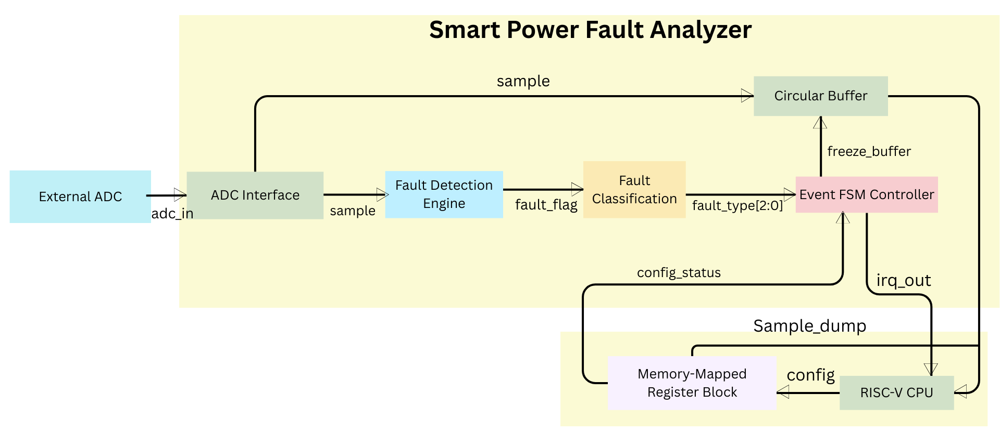
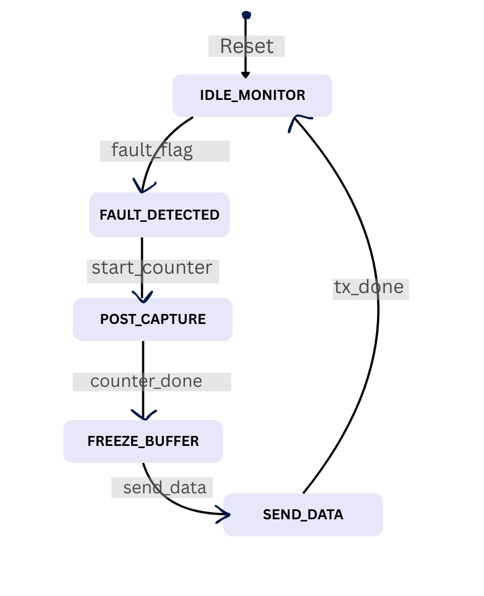
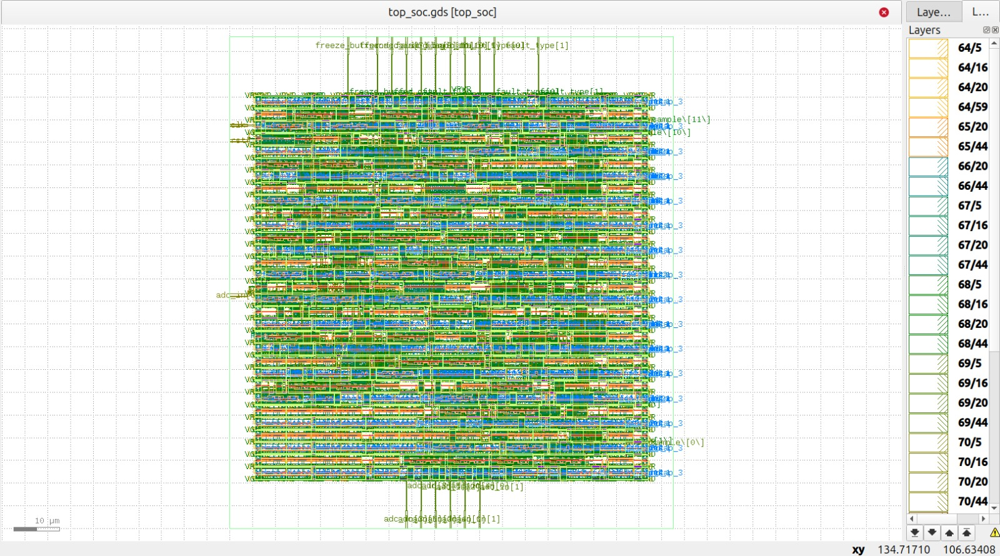

<h1>Smart Power Fault Analyzer SoC</h1>

<b>Real-Time Power Monitoring and Fault Classification IP for SoC Systems</b>

ASIC-Ready | OpenLane | Sky130

## Table of Contents
- [Problem Statement](#1-problem-statement)
- [Proposed Solution](#2-proposed-solution)
- [System Architecture](#3-system-architecture)
- [Control FSM Design](#4-control-fsm-design)
- [Verification Results](#5-verification-results)
- [GDS Layout - Smart fault analyzer : top_soc](#6-gds-layout---smart-fault-analyzer--top_soc)
- [Implementation Status](#7-implementation-status)
- [Scalability and Future Scope](#8-scalability-and-future-scope)
- [Applications](#9-applications)
- [Documentation & Resources](#documentation--resources)
- [Project Structure](#project-structure)
- [License](#license)
- [Contact](#contact)

---
## 1. Problem Statement
Modern **embedded** and** SoC-based** systems require **stable power** supply for proper operation. However, issues such as **over-voltage**, **under-voltage**, and sudden **current spikes** can **damage** the system or **reduce reliability**.

**Traditional fault detection** systems have several limitations:
- They use **fixed thresholds** and cannot be changed during operation.
- They are not integrated with the processor, so decision-making is **limited**.
- They rely on external monitoring circuits, which **increases response time**.

Therefore, a **configurable** and **fast fault detection** system integrated within the SoC is required.

---
## 2. Proposed Solution
The **Smart Power Fault Analyzer** is a hardware IP block integrated into the SoC. It continuously monitors **power signals** and **detects faults** in real time.\
**Main capabilities**:
- Continuous monitoring of power signals using **ADC input**
- **Detection** and **classification of faults** (over-voltage, under-voltage, spikes)
- **Fast response** using hardware logic
- **Interrupt generation** to notify the processor immediately

This makes the system **reliable** and **suitable** for real-time **applications**.

---
### Comparison with Traditional Methods

| Feature        | Proposed SoC Solution                  | Traditional External System          |
|---------------|--------------------------------------|------------------------------------|
| **Response Time** | **Nanoseconds** to Microseconds          | Milliseconds to Seconds            |
| **Thresholds**    | **Software-programmable** (via registers)| Fixed hardware-based               |
| **Footprint**     | **Integrated** (no extra PCB space)      | External (extra board area needed) |
| **Intelligence**  | **FSM-based classification**             | Simple "Trip / No Trip" logic      |

---
## 3. System Architecture
The design consists of **four main** subsystems:\
**1. Signal Acquisition** – Receives and **synchronizes ADC input** samples  
**2. Fault Processing** – Compares inputs with **thresholds** and **detects faults**  
**3. Data Capture** – Circular buffer stores **pre/post fault data** (black box)  
**4. Control Logic (FSM)** – Manages **detection**, **capture**, and **communication**

### Block Architecture Diagram

  

---

## 4. Control FSM Design
The system operates using a **finite state machine** with the following states:

- **Monitor**: Normal operation, continuously checking signals
- **Fault**: Fault condition detected
- **Post Capture**: Additional data is recorded
- **Freeze**: Buffer is stopped to preserve data
- **Send**: Data/interrupt is sent to the processor

This ensures **controlled** and **predictable** system behavior.

### FSM Diagram

  

---

 ## 5. Verification Results
- The design is functionally verified using GTKWave simulation. The waveform shows correct behavior of fault detection and FSM-based control logic. When the input signal (`adc_in`) crosses the defined threshold, the `fault_flag` is asserted, and the fault type is classified correctly (`fault_type = 01`). 
- The FSM transitions through its expected states, triggering `freeze_buffer` to capture data and asserting `send_data` for processor communication. The interrupt signaling and control flow operate as intended, confirming reliable real-time fault detection.
- The results demonstrate that the system responds quickly and deterministically to fault conditions. The design can be further improved by extending support for multi-channel monitoring, adaptive thresholds, and enhanced fault classification mechanisms.

 

  

---
## 6. GDS Layout - Smart fault analyzer : top_soc 

  

---
## 7. Implementation Status
- **RTL modules implemented**: ADC Interface, Fault Detection Engine, Fault Classification, Circular Buffer, Event FSM Controller  
- **Functional verification** performed for **fault detection** and **FSM behavior**  

### Future Work
- Design and implement **memory-mapped register** interface for configuration and status monitoring  
- Integrate **interrupt (IRQ)** interface for processor communication  
- Integrate with **Caravel SoC** platform

---
 ## 8. Scalability and Future Scope
The proposed **Smart Power Fault Analyzer SoC** is designed with a **modular** and **scalable architecture**, enabling f**uture extensions** without major **redesign**.
- Multi-channel monitoring support
- Extension to voltage, current, and temperature sensing
- On-chip ADC integration
- Advanced fault logging and analytics
- Potential evolution into full power management IP

---
## 9. Applications
### Industrial Systems
- Motor controllers  
- Power converters  
- PLC systems  

### Commercial Systems
- Server power management  
- Smart meters  
- Battery management systems  

### Edge / IoT Systems
- Smart gateways  
- Remote monitoring nodes  
- Solar inverters  
- EV charging systems  

---

## Documentation & Resources
For detailed hardware specifications and register maps, refer to the following official documents:

* **[SoC-Based Early Fault Detector](https://link.springer.com/chapter/10.1007/978-981-97-8476-9_26)**: Development of SoC-Based Early Fault Detector System for Induction Motors.
* **[Adaptive Protection](https://arxiv.org/pdf/2308.15917)**: On-Chip Sensors Data Collection and Analysis for
SoC Health Management.
### AI-Assisted Workflow
- Design understanding and architecture planning
- RTL debugging and refinement
- Documentation structuring
* **[How can I design a Smart Power Fault Analyzer SoC for real-time monitoring?](https://chatgpt.com/c/69b99075-96c0-8324-91ed-80040d785bbe)**: A digital instrument designed to monitor, detect, and diagnose abnormalities in electrical systems in real time.
* **[Comparison with Traditional Methods](https://www.google.com/search?sourceid=chrome&ie=UTF-8&amc=1&gs_lcrp=EgZjaHJvbWUyBggAEEUYOdIBCzI2MzI2NWowajMzqAIGsAIB&oq=smart+power+fault+analyzer+&aep=26&cud=0&qsubts=1774077276685&source=chrome.crn.obic&mtid=LXK5ae-uJq_jseMPt5DIiQg&udm=50&mstk=AUtExfCQOAU0FJd76G0wceVjs3lYZgZDLBDH20uBdGQ-Q9c0K4jlwo16JJ6TFQBaN6j_2w8VRk6MsLESNSLDGPncxSGNuIKPguPVU58X5bw2AvnL-BsUZTgUnc9WpHgNYAFzVw0lVKRu2SgBlhZmuJVl6iHaOBjSF8r-7SKNJvwjB3Upr13AohVUxf719vEyt1c97yaoFF6qrA4EP57bsxv2EklqcaCfNGSVLEw_arrTeNH4WOVJUvH7EJtxv3DpIl06-K9Hb5DBbuw6_Q&csuir=1&q=Problem+Statement+Modern+embedded+and+SoC-based+systems+require+stable+power+supply+for+proper+operation.+However%2C+issues+such+as+over-voltage%2C+under-voltage%2C+and+sudden+current+spikes+can+damage+the+system+or+reduce+reliability.+Traditional+fault+detection+systems+have+several+limitations%3A+They+use+fixed+thresholds+and+cannot+be+changed+during+operation.+They+are+not+integrated+with+the+processor%2C+so+decision-making+is+limited.+They+rely+on+external+monitoring+circuits%2C+which+increases+response+time.+Therefore%2C+a+configurable+and+fast+fault+detection+system+integrated+within+the+SoC+is+required.+i+want+to+know+there+is+a+solution+whic+is+made+like+soc%3F&atvm=2)**:  Compare our Proposed Soc with a traditional or old method
* **[Waveform Debug](https://chatgpt.com/c/69b9765c-bc60-8324-8daf-400bc8c293d0)**: Debug error and Functional verification of fault detection and FSM behavior using GTKWave simulation.

---
## Project Structure

| Directory / File | Description |
|------------------|-------------|
| [`verilog/rtl/smart_fault_analyzer`](verilog/rtl/smart_fault_analyzer) | RTL source code for Smart Power Fault Analyzer modules (ADC interface, fault detection, FSM, buffer) |
| [`verilog/rtl/smart_fault_analyzer/tb`](verilog/rtl/smart_fault_analyzer/tb) | Testbench files for functional verification |
| [`openlane/top_soc/final/gds/`](openlane/top_soc/gds/) | GDSII layout file (`top_soc.gds`) |
| [`openlane/top_soc/final/lef/`](openlane/top_soc/lef/) | LEF files for layout abstraction |
| [`openlane/top_soc/final/def/`](openlane/top_soc/def/) | Placement and routing data |
| [`verilog/rtl/smart_fault_analyzer/assets`](verilog/rtl/smart_fault_analyzer/assets) | Architecture diagrams, waveform images, and GDS images |
| [`README.md`](README.md) | Project overview and documentation |

---
## License
This project is licensed under the [Apache License 2.0](http://www.apache.org/licenses/).

## Contact
Questions and collaboration: shikhatiwari2112@gmail.com

---

