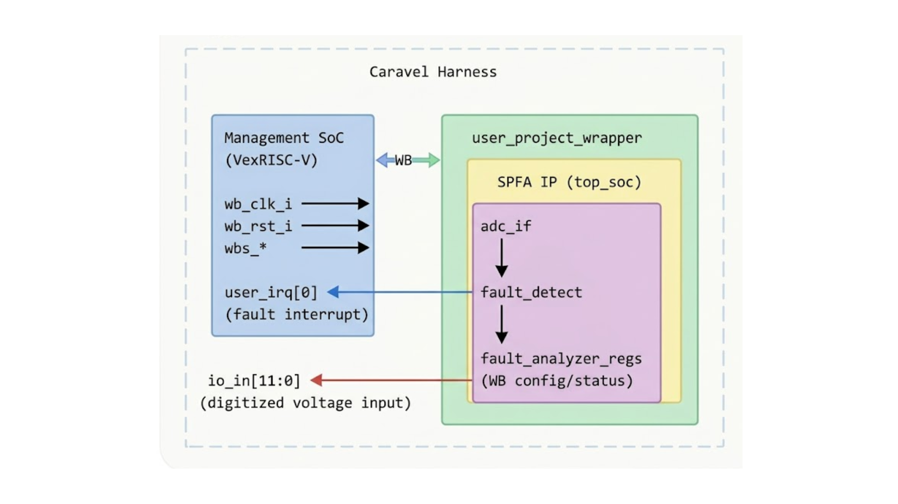
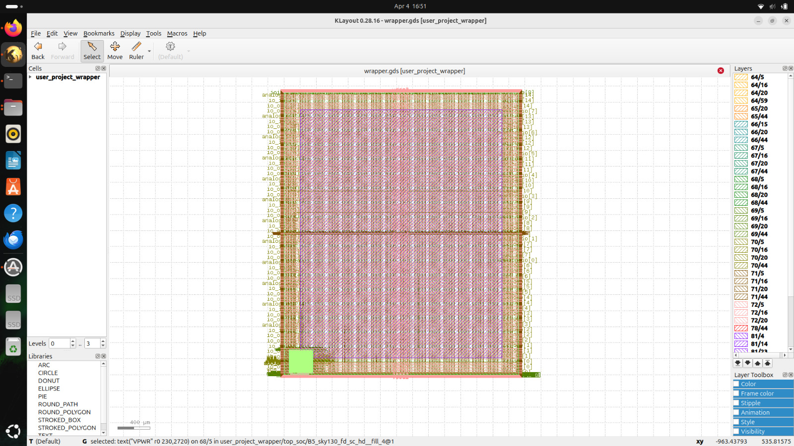
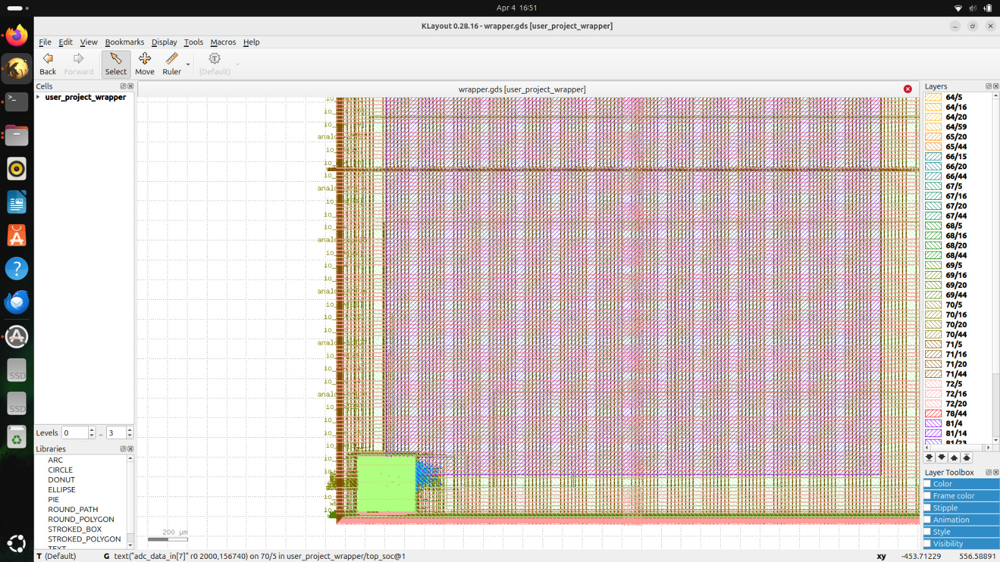

<div align="center">


<h1>Smart Power Fault Analyzer SoC</h1>

<p><b>Real-Time Power Monitoring and Fault Classification IP for SoC Systems</b></p>

<p>
ASIC-Ready | OpenLane | Sky130
</p>

[](https://opensource.org/licenses/Apache-2.0)
[](https://platform.chipfoundry.io/marketplace)

</div>

### Project Information
**Project:** Smart Power Fault Analyzer (SPFA)  
**Target Application:** Electric Vehicle Battery Management System (EV-BMS) Safety Monitoring  
**Technology Platform:** Efabless Caravel SoC Harness  
**PDK:** SkyWater 130nm (Sky130A) Open-Source PDK  
**Design Flow:** OpenLane chipIgnite flow  
**Language:** Verilog HDL  
**Verification:** Cocotb / Icarus Verilog  

## Table of Contents
- [Problem Statement](#1-problem-statement)
- [Proposed Solution](#2-proposed-solution)
- [Application: EV Battery Management System (BMS)](#3-application-ev-battery-management-system-bms)
- [Feasibility & Cost Analysis](#4-feasibility--cost-analysis)
- [Caravel SoC Integration](#5-caravel-soc-integration)
- [GPIO Configurations](#6-gpio-configurations)
- [Verification Results](#7-verification-results)
- [Documentation & Resources](#documentation--resources)
- [Project Structure](#project-structure)
- [License](#license)
- [Contact](#contact)

---
## 1. Problem Statement
Modern **SoC-based embedded systems** rely on a **stable power supply** for correct operation. Unexpected events such as **over-voltage**, **under-voltage**, or **sudden current spikes** can cause:
- Component damage 
-	System crashes 
-	Reduced reliability and lifetime

**Limitations of traditional fault detection:**
- Fixed thresholds that cannot adapt during operation 
-	Separate monitoring circuits not integrated with the processor - slow decision-making 
-	Software-based detection suffers from latency, risking catastrophic failures

**Need:** A **fast**, **configurable**, **SoC-integrated fault detection** system that reacts in real time to **protect the system**.

---
## 2. Proposed Solution
The **Smart Power Fault Analyzer** SoC is a hardware IP block, real-time **power fault detection** and **classification** system integrated into the **Caravel harness**.\
It continuously monitors a **12-bit ADC input**, compares sampled values against a **programmable threshold**, classifies **fault types**, and **raises maskable interrupt requests (IRQs)** to the Caravel management **RISC-V core** via the **Wishbone bus**.
### Key Features
| Feature | Description |
|--------|-------------|
| **12-bit ADC Interface** | Samples power signal via `io_in[11:0]` GPIO pads |
| **Fault Detection Engine** | Classifies overvoltage, undervoltage, and anomaly faults |
| **Wishbone Slave Interface** | Full 32-bit WB MI A compatible register interface |
| **Maskable IRQ** | `user_irq[0]` raised on fault detection |
| **Programmable Threshold** | 16-bit threshold register via WB address `0x04` |
| **Fault Mask Register** | 8-bit mask for selective fault enabling |
| **IRQ Latch & Clear** | Edge-triggered IRQ with software-clearable status |

---
## 3. Application: EV Battery Management System (BMS)
This chip is designed as a **hardware-based voltage fault monitoring IP** for Electric Vehicle Battery Management Systems (EV-BMS).  
It enables real-time detection of **over-voltage and under-voltage conditions** with deterministic, low-latency response, overcoming the limitations of traditional software-based monitoring approaches.

### 1️⃣ Architectural Gap: Why This IP is Needed
EV Battery Management Systems require fast and reliable voltage monitoring under highly dynamic operating conditions:
- **Electrical Variations:** Voltage fluctuations during battery charging and discharging cycles  
- **Safety Requirements:** Deterministic detection of abnormal voltage conditions  
- **Dynamic Limits:** Configurable thresholds required for different operating states  

Traditional solutions rely on **software polling and external analog protection circuits**, which introduce:
- Non-deterministic response latency  
- Limited configurability and scalability  
- Increased system complexity and hardware cost  

### 2️⃣ System Integration: How the IP Operates
The **Smart Power Fault Analyzer (SPFA)** is integrated within the BMS SoC as a dedicated hardware monitoring IP block:
1. **Voltage Sampling** – Receives digitized voltage inputs from an external ADC  
2. **Threshold Configuration** – System processor configures voltage limits via control registers  
3. **Fault Detection** – Comparator logic evaluates thresholds and detects faults in a single clock cycle  
4. **Fault Signaling** – Generates an interrupt or status flag to the system controller  
5. **System Response** – Controller executes protective actions (e.g., disconnect battery, limit charging current)

### 3️⃣ Deployment Scenario: EV Battery Protection
In an EV Battery Management System, the SPFA module continuously monitors
battery voltage levels through digitized ADC inputs.

**When abnormal voltage conditions are detected**:
- **Over-voltage:** Charging current is reduced or disconnected  
- **Under-voltage:** Load isolation or system shutdown is triggered  
- **Voltage spike:** Controller performs immediate protection action  

The hardware interrupt generated by **SPFA** enables the system controller
to respond instantly, improving safety and system reliability.

### EV-BMS System Architecture
**Future EV BMS** architecture showing SPFA IP integrated on SoC for real-time fault detection and hardware safety interlocks (Caravel integration in progress).


---
## 4. Feasibility & Cost Analysis
### Bill of Materials (BOM) Comparison – EV BMS
This comparison illustrates a typical EV Battery Management System (BMS) implementation using discrete components versus a system integrating the **Smart Power Fault Analyzer (SPFA)** as an on-chip hardware IP.

| Component Category | Conventional Design (Discrete/COTS) | SPFA-Based SoC Approach | Impact |
|-------------------|--------------------------------------|------------------------|--------|
| Main Controller | Automotive-grade MCU | Integrated processor within SoC platform | Reduced external components |
| Fault Monitoring | Dedicated analog front-end / protection IC | On-chip SPFA hardware IP | Eliminates separate monitoring IC |
| Signal Conditioning | External analog circuitry | Simplified digital interface from ADC | Reduced analog circuitry |
| External Memory | Optional EEPROM / Flash | Integrated or system-level memory | Potential component reduction |
| PCB Complexity | Higher routing density | Simplified interconnect | Reduced PCB complexity |

### 💎 Estimated System Impact
- **Reduced external component count** due to integration of monitoring logic within the SoC  
- **Lower PCB routing complexity** by minimizing external analog protection circuitry  
- **Improved system reliability** due to fewer discrete components and interconnects  
- **Better scalability** since voltage thresholds and monitoring logic are configurable in hardware

---
## 5. Caravel SOC Integration
The **Smart Power Fault Analyzer (SPFA)** is integrated as a user IP inside the
Caravel SoC harness.
The module interfaces with the **Wishbone bus** for configuration
and receives **digitized voltage inputs** through the **GPIO interface**.



### Integration Overview
The SPFA module connects to the Caravel system through three primary interfaces:

| Interface | Signal | Description |
|----------|--------|-------------|
| Wishbone | wb_* | Configuration and status register access |
| GPIO Input | io_in[11:0] | Digitized voltage from external ADC |
| Interrupt | user_irq[0] | Fault detection notification to CPU |
| Clock | wb_clk_i | System clock |
| Reset | wb_rst_i | Global reset |

The hardware performs voltage monitoring and fault detection in a single clock
cycle, enabling deterministic fault response for safety-critical systems.

---
## GDS Layout - user_project_wrapper


### 👉 Integration Details
- **Bus Interface:** Wishbone slave connected to Caravel management SoC  
- **Control Path:** CPU configures thresholds via memory-mapped registers  
- **Data Path:** ADC input (`io_in[11:0]`) processed in real-time  
- **Interrupt Handling:** Fault events trigger `user_irq[0]`  


---
## 6. GPIO Configurations
The SPFA module interfaces with the Caravel SoC using GPIO pins
for receiving digitized voltage samples and generating fault interrupts.
- [IO & Pin Description](verilog/rtl/smart_fault_analyzer/README.md)

---
 ## 7. Verification Results
 The **Smart Power Fault Analyzer** (SPFA) was **verified** at multiple levels to ensure
correct **functionality** and **system** integration.

Verification includes:
- **RTL simulation** using Icarus Verilog testbench
- **Firmware-level verification** using cocotb with C firmware

 ### 👉 RTL Simulation (iverilog)
- [RTL-Level Verification](verilog/rtl/README.md)

 ### 👉 Firmware Simulation (cocotb)
**Tool:** cocotb v1.9.2 + Icarus Verilog 12.0
| Test | Simulation | Result | Duration |
|---|---|---|---|
| `top_soc` | Firmware |  **PASSED** | 30,000 ns |

**Test Log Evidence:**\


| Firmware Files | [`verilog/dv/cocotb/user_proj_tests/top_soc`](verilog/dv/cocotb/user_proj_tests/top_soc) 
### Run Simulation
```bash
# Configure GPIO first
cf gpio-config

# Run test
cf verify top_soc
```
---
## Documentation & Resources
For detailed hardware specifications and register maps, refer to the following official documents:

* **[SoC-Based Early Fault Detector](https://link.springer.com/chapter/10.1007/978-981-97-8476-9_26)**: Development of SoC-Based Early Fault Detector System for Induction Motors.
* **[Fault Detection and Diagnosis of the EV](https://www.mdpi.com/2075-1702/11/7/713))**: Development of SoC-Based Early Fault Detector System for Induction Motors.

### AI-Assisted Workflow & Queries
- Design understanding and architecture planning
- RTL debugging and refinement
- Documentation structuring
* **How can I design a Smart Power Fault Analyzer SoC for real-time monitoring?**  *Tools used: ChatGPT*\
  Focus on architecture design, including ADC interfacing, threshold-based fault detection, FSM control, interrupt generation, and SoC integration.
* **Debug and verification of Soc**  *Tools used: ChatGPT*\
 Validate Firmware verification - top_soc.c , top_soc.py & top_soc.yaml
* **Future EV BMS Architecture** : Generated By AI tool used: Google Gemini
---
## Project Structure

| Directory / File | Description |
|------------------|-------------|
| [`verilog/rtl/smart_fault_analyzer`](verilog/rtl/smart_fault_analyzer) | RTL source code for Smart Power Fault Analyzer modules (ADC interface, fault detection, FSM, buffer) |
| [`verilog/rtl/smart_fault_analyzer/tb`](verilog/rtl/smart_fault_analyzer/tb) | Testbench files for functional verification |
| [`openlane/top_soc/final/gds`](openlane/top_soc/gds) | GDSII layout file (`top_soc.gds`) |
| [`openlane/user_project_wrapper/final/gds`](openlane/user_project_wrapper/gds) | GDSII layout file (`user_project_wrapper.gds`)|
| [`verilog/dv/cocotb/user_proj_tests/top_soc`](verilog/dv/cocotb/user_proj_tests/top_soc) | Firmware Verification |
| [`verilog/rtl/smart_fault_analyzer/assets`](verilog/rtl/smart_fault_analyzer/docs) | Architecture diagrams, waveform images, and GDS images |
| [`README.md`](README.md) | Project overview and documentation |

---
## License
This project is licensed under the [Apache License 2.0](http://www.apache.org/licenses/).

## Contact
Questions and collaboration: shikhatiwari2112@gmail.com

---


