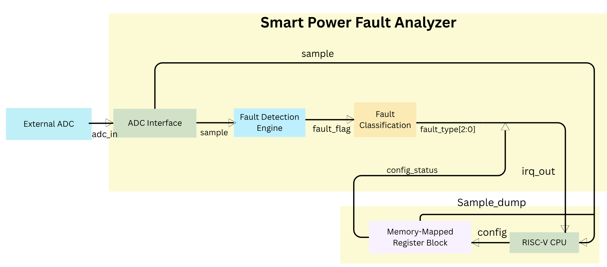
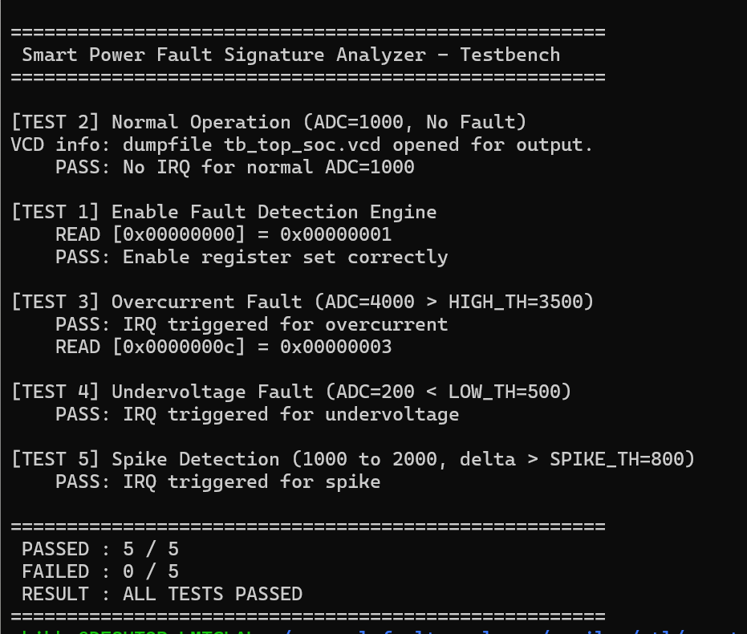
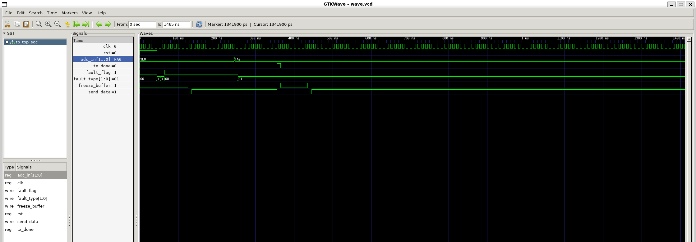
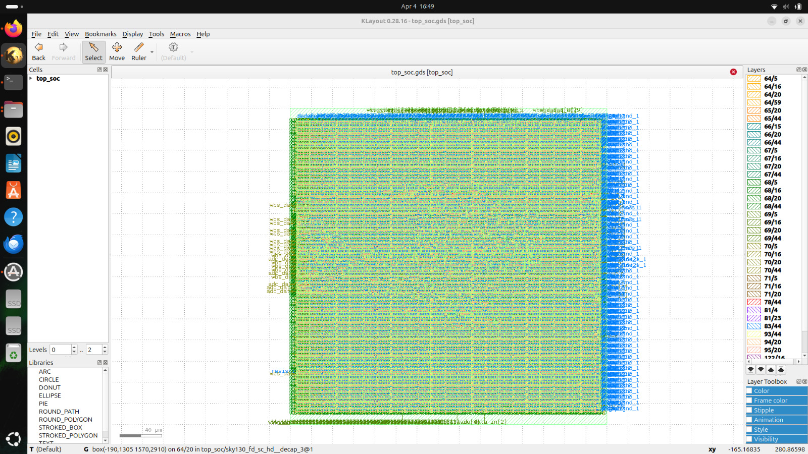

## Table of Contents
- [SPFA Architecture Overview](#1-spfa-architecture-overview)
- [Module Descriptions](#2-module-descriptions)
- [RTL-Level Verification](#3-rtl-level-verification)
- [IO & Pin Description](#4--io--pin-description)
- [GDS Layout](#5-gds-layout)

---
## 1. SPFA Architecture Overview
The Smart Power Fault Analyzer (SPFA) is a hardware IP designed for real-time voltage fault detection within a SoC.
- **ADC Interface:** Captures and synchronizes input voltage samples  
- **Fault Detection Logic:** Performs threshold comparison  
- **Register Interface:** Enables configuration and status monitoring  
- **Interrupt Output:** Signals fault events to the processor

  

---
## 2. Module Descriptions
### `adc.v` - ADC Interface
- Samples 12-bit input `io_in[11:0]` on each clock cycle  
- Provides synchronized output `sample_out[11:0]`  
- Aligns external ADC data to the system clock domain
### `fault_detect.v` - Fault Detection Logic
- Compares input sample against programmable thresholds  
- Generates `fault_flag` on threshold violation  
- Supports detection of:
  - Under-voltage  
  - Over-voltage  
- Designed for single-cycle detection latency  
### `fault_analyzer_regs.v` - Register Interface (Wishbone)
- Implements Wishbone slave interface  
- Provides memory-mapped configuration registers  
- Supports:
  - Threshold configuration  
  - Fault status monitoring  
  - Interrupt control  
- Generates interrupt (`user_irq`) on fault events  
### `top_soc.v` - Top-Level Integration
- Integrates all submodules into a single SoC block  
- Connects `io_in[11:0]` to ADC interface  
- Interfaces with Caravel via Wishbone bus  
- Routes fault interrupt to `user_irq[0]`  

---
## 3. RTL-Level Verification
Simulation was performed using a dedicated testbench to validate core functionality.

**Verification environment:**
- **Simulator:** Icarus Verilog
- **Testbench:** Custom Verilog testbench
- **Waveform analysis:** GTKWave

### Integration Test Results
| Test ID | Test Scenario | Input Condition | Expected Behavior | Result |
|-------|---------------|----------------|------------------|--------|
| TEST 1 | Enable Fault Detection Engine | Enable register write | Fault detection module activates | PASS |
| TEST 2 | Normal Operation | ADC = 1000 | No interrupt generated | PASS |
| TEST 3 | Overcurrent Fault | ADC = 4000 (> HIGH_TH = 3500) | IRQ triggered for overcurrent | PASS |
| TEST 4 | Undervoltage Fault | ADC = 200 (< LOW_TH = 500) | IRQ triggered for undervoltage | PASS |
| TEST 5 | Spike Detection | 1000 → 2000 (Δ > SPIKE_TH = 800) | IRQ triggered for spike | PASS |

### 👉 Build & Run
**Run Simulation**
```bash
iverilog -g2012 -o sim \
    tb/tb_top_soc.v \
    top_soc.v adc.v fault_detect.v fault_analyzer_regs.v \
    && vvp sim
```
```bash
gtkwave tb_top_soc.fst
```
### Test log evidence
  

### Waveform
  


---
## 4. 📌 IO & Pin Description
### GPIO Mapping
| GPIO Pin | Direction | Signal | Description |
|---|---|---|---|
| `io_in[0]` | Input | `adc_data_in[0]` | ADC bit 0 (LSB) |
| `io_in[1]` | Input | `adc_data_in[1]` | ADC bit 1 |
| `io_in[2]` | Input | `adc_data_in[2]` | ADC bit 2 |
| `io_in[3]` | Input | `adc_data_in[3]` | ADC bit 3 |
| `io_in[4]` | Input | `adc_data_in[4]` | ADC bit 4 |
| `io_in[5]` | Input | `adc_data_in[5]` | ADC bit 5 |
| `io_in[6]` | Input | `adc_data_in[6]` | ADC bit 6 |
| `io_in[7]` | Input | `adc_data_in[7]` | ADC bit 7 |
| `io_in[8]` | Input | `adc_data_in[8]` | ADC bit 8 |
| `io_in[9]` | Input | `adc_data_in[9]` | ADC bit 9 |
| `io_in[10]` | Input | `adc_data_in[10]` | ADC bit 10 |
| `io_in[11]` | Input | `adc_data_in[11]` | ADC bit 11 (MSB) |
| `io_in[12:37]` | Input | Unused | Pulled low |

### GPIO Configuration
All GPIO pins configured as `GPIO_MODE: INPUT NOPULL` (user-controlled inputs, no pull resistor).
### Wishbone Interface
| Signal | Width | Direction | Description |
|---|---|---|---|
| `wb_clk_i` | 1 | Input | System clock (25 MHz) |
| `wb_rst_i` | 1 | Input | Active-high reset |
| `wbs_cyc_i` | 1 | Input | WB cycle valid |
| `wbs_stb_i` | 1 | Input | WB strobe |
| `wbs_we_i` | 1 | Input | Write enable |
| `wbs_sel_i` | 4 | Input | Byte select |
| `wbs_adr_i` | 32 | Input | Address |
| `wbs_dat_i` | 32 | Input | Write data |
| `wbs_ack_o` | 1 | Output | Acknowledge |
| `wbs_dat_o` | 32 | Output | Read data |

### Interrupt
| Signal | Description |
|---|---|
| `user_irq[0]` | Fault detected IRQ (active high, latched) |
| `user_irq[1:2]` | Reserved (tied low) |

---
## 🗂️ Register Map
Base Address: `0x30000000`
| Offset | Register | R/W | Description |
|---|---|---|---|
| `0x00` | `REG_ENABLE` | R/W | Bit[0]: Enable fault detection engine |
| `0x04` | `REG_THRESHOLD` | R/W | Bits[15:0]: Fault threshold (ADC counts) |
| `0x08` | `REG_FAULT_MASK` | R/W | Bits[7:0]: IRQ enable mask per fault type |
| `0x0C` | `REG_IRQ_STATUS` | R | Bits[7:0]: Latched fault flags (read to check) |
| `0x10` | `REG_ADC_VALUE` | R | Bits[15:0]: Last sampled ADC value |
| `0x14` | `REG_IRQ_CLEAR` | W | Write 1 to clear corresponding IRQ flag |

---
## 5. GDS Layout
### Smart fault analyzer : top_soc
  

